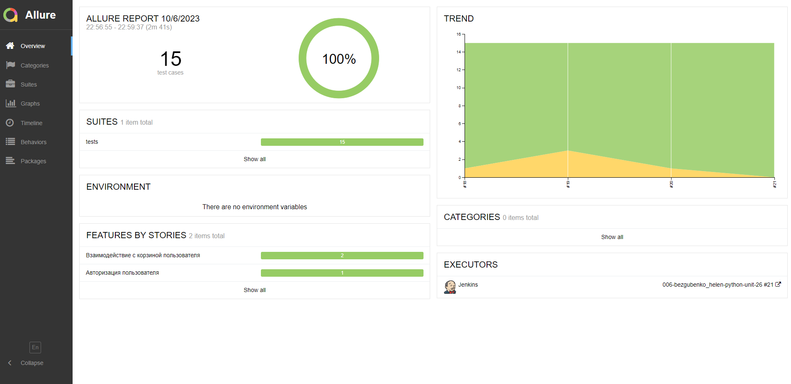
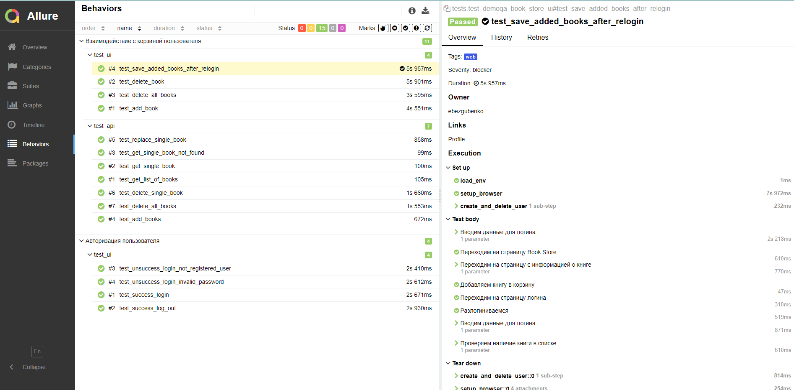
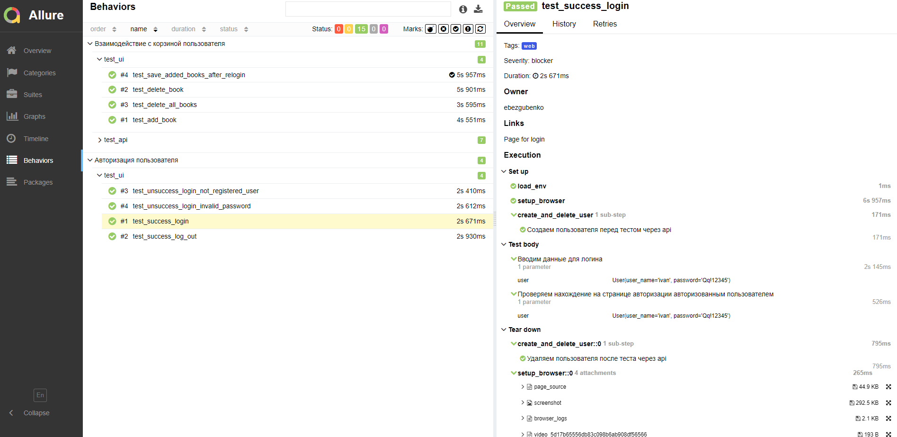
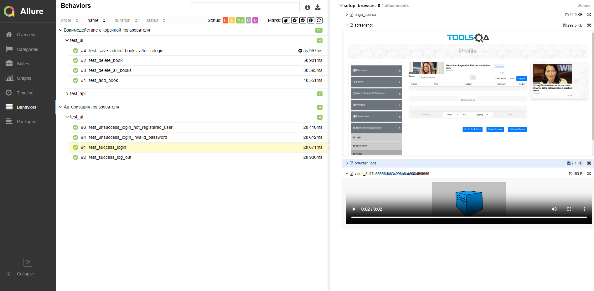
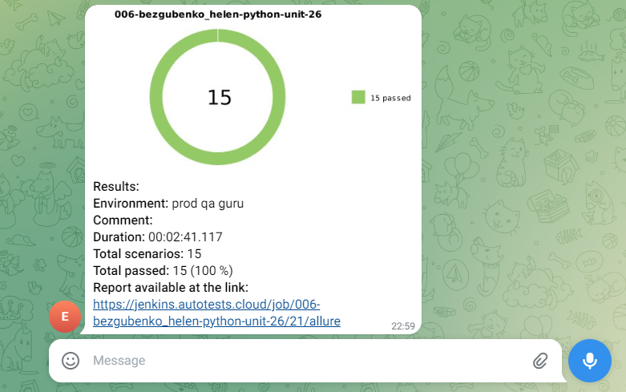

# Проект автотестов для учебного сайта [demoqa.com (Book Store Application)](https://demoqa.com/books)

## Описание проекта
* В проекте представлены UI и API автотесты на Python с использованием Selene для UI-тестов 
и Requests, Curlify и Jsonschema для API-тестов.
* При создании тестов применен паттерн PageObject.
* Тесты атомарные - перед запуском каждого теста создается пользователь,
после прохождения теста пользователь удаляется.
* Тесты запускаются удаленно на Selenoid.
* Подключена интеграция с Allure Reports.
* Уведомления о завершении тестов направляются в Telegram.

## Тестовые сценарии

### - UI тесты
#### - Авторизация пользователя
 - [x] Успешный логин зарегистрированного пользователя
 - [x] Успешный выход из личного кабинета
 - [x] Неуспешный логин незарегистрированного пользователя
 - [x] Неуспешный логин зарегистрированного пользователя с неверным паролем
  
#### - Взаимодействие с корзиной пользователя
 - [x] Успешное добавление книги в корзину
 - [x] Успешное удаление книги из корзины
 - [x] Успешное удаление всех книг из корзины
 - [x] Сохранение добавленных книг в корзине после ре-логина

### - API тесты
 - [x] Получение информации о всех книгах
 - [x] Получение информации об определенной книге по ее идентификатору
 - [x] Ошибка при попытке получить информацию о книге по несуществующему идентификатору
 - [x] Успешное добавление книг в корзину по их идентификаторам
 - [x] Замена одной из книг в корзине на другую
 - [x] Удаление одной книги в корзине по ее идентификатору
 - [x] Уделание всех книг из корзины

## Используемые технологии


## Локальный запуск
- Склонировать репозиторий
- Открыть проект в PyCharm
- В терминале выполнить скрипт
```commandline
python -m venv .venv
source .venv/bin/activate
pip install -r requirements.txt
pytest .
```

## Запуск автотестов из Jenkins
#### Создать сборку в Jenkins и нажать кнопку `Собрать`.


#### Пример завершенной сборки можно посмотреть по [ссылке](https://jenkins.autotests.cloud/job/006-bezgubenko_helen-python-unit-26/)


## Отчеты о прохождении тестов в Allure
### Информация о прохождении тестов доступна в Allure:
#### Общий обзор результатов тестового запуска



#### С разбивкой по группам сценариев



#### Для каждого теста - предусловия, шаги, постусловия



#### В приложении к тесту - скриншот страницы, логи и видео прохождения тест-кейса



## Уведомления о прохождении тестов в Telegram
**Приходит после завершения каждого запуска тестов**


